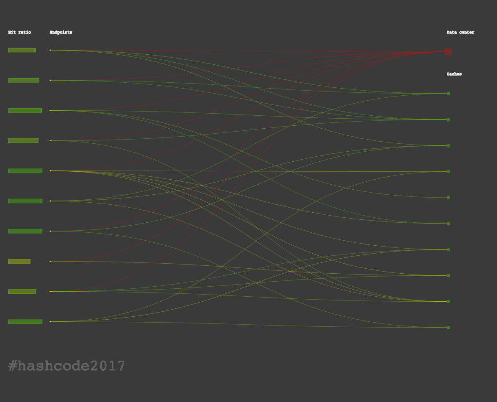
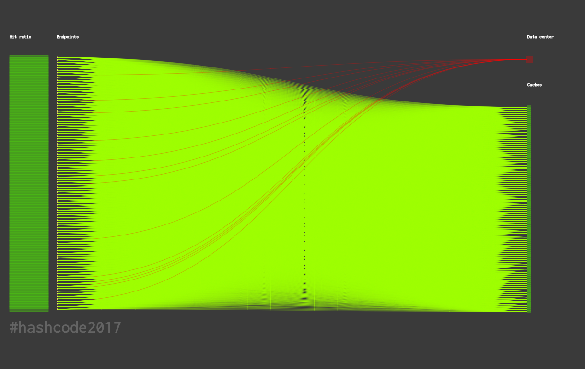
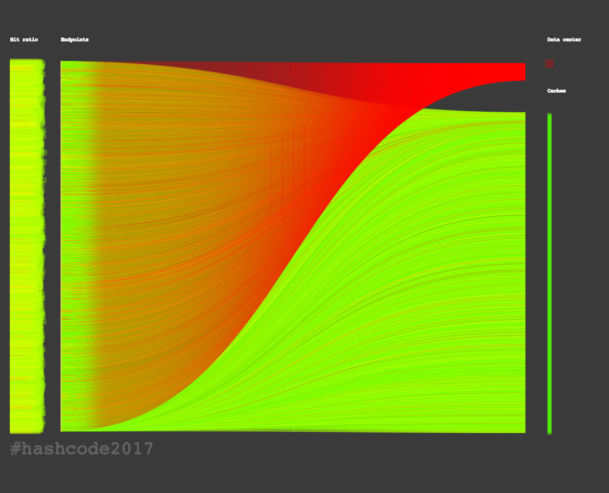

# Google \#Hash Code 2017 Online Qualification Round

Solutions and code for the [Google \#Hash Code 2017 Challenge](https://hashcode.withgoogle.com) **"Optimize Cache Servers for YouTube"** of our Team _Gyrating Flibbittygibbitts_.

The problem statement can be found [here](hashcode2017_streaming_videos.pdf).

The input files can be found in `input/`
* [Me at the zoo](input/me_at_the_zoo.in)
* [Videos worth spreading](input/videos_worth_spreading.in)
* [Trending today](input/trending_today.in)
* [Kittens](input/kittens.in)

> Have you ever wondered what happens behind the scenes when you watch a YouTube video? 
> As more and more people watch online videos (and as the size of these videos increases), it is critical that video-serving infrastructure is optimized to handle requests reliably and quickly.
> This typically involves putting in place cache servers, which store copies of popular videos.
> When a user request for a particular video arrives, it can be handled by a cache server close to the user, rather than by a remote data center thousands of kilometers away.
> Given a description of cache servers, network endpoints and videos, along with predicted requests for individual videos, decide which videos to put in which cache server in order to minimize the average waiting time for all requests.
>
> _from [Problem statement for Online Qualification Round, Google \#Hash Code 2017](https://hashcode.withgoogle.com/past_editions.html)_

## Algorithm
tba.

## Scores

Overall **2565511** points.

Highest score during the _Online Qualification Round_ was 2651999 (Team _Ababahalamaha_), and 2653781 (Team _Master Exploder_) in the _Extended Round_.

#### Me at the zoo
_`498287`_ points, processed in `0.01 seconds`.

Highest score seen is 516557 [*](http://codeforces.com/blog/entry/50624?#comment-345914)

#### Videos worth spreading
_`549640`_ points, processed in `4.35 seconds`.

Highest score seen is 610759 [*](http://codeforces.com/blog/entry/50624?#comment-345776)

#### Trending today
_`499966`_ points, processed in `22.12 seconds`.

Highest score seen is 499991 [*](http://codeforces.com/blog/entry/50624?#comment-345776)

#### Kittens
_`1017618`_ points, processed in `19893.92 seconds`

Highest score seen is 1024846 [*](http://codeforces.com/blog/entry/50624?#comment-345776)

## Authors

Sebastian Brodehl / [@sbrodehl](https://github.com/sbrodehl)

Alexej Disterhoft / [@nobbs](https://github.com/nobbs)

Dennis Meyer / [@snakebite1457](https://github.com/snakebite1457)
