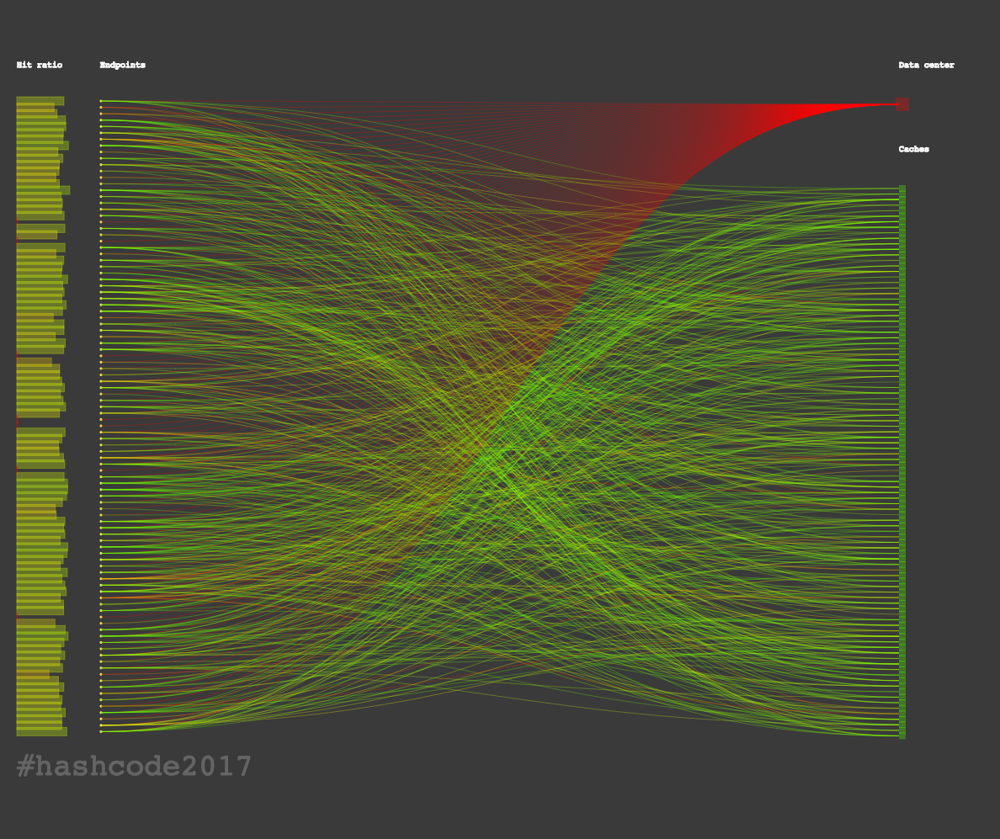
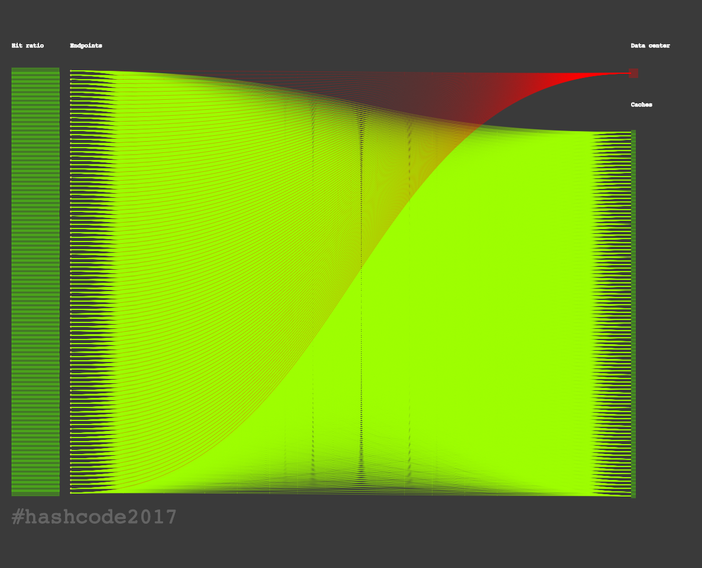
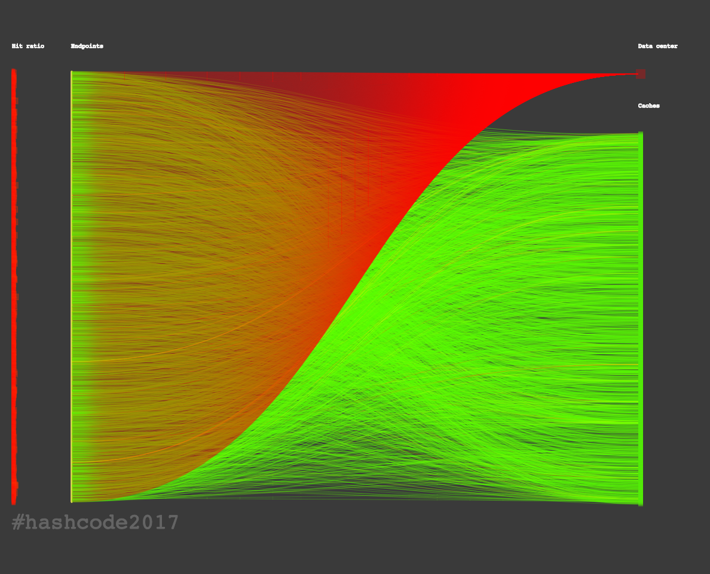

# HashCode

Solutions and code for the [Google \#HashCode 2017 Challenge](https://hashcode.withgoogle.com) of our Team _Gyrating Flibbittygibbitts_.

The problem statement can be found [here](hashcode2017_streaming_videos.pdf).

## Algorithm
tba.

## Scores

Overall **2561212** points.

Highest score during the _Online Qualification Round_ was 2651999 (Team _Ababahalamaha_), and 2653781 (Team _Master Exploder_) in the _Extended Round_.

#### Me at the zoo
_`498287`_ points, processed in `0.11 seconds`.

Highest score seen is 516557 [*](http://codeforces.com/blog/entry/50624?#comment-345914)

#### Videos worth spreading
_`549640`_ points, processed in `4.35 seconds`.

Highest score seen is 610759 [*](http://codeforces.com/blog/entry/50624?#comment-345776)

#### Trending today
_`495667`_ points, processed in `23.8 seconds`.

Highest score seen is 499991 [*](http://codeforces.com/blog/entry/50624?#comment-345776)

#### Kittens
_`1017618`_ points, processed in `19893.92 seconds`

Highest score seen is 1024846 [*](http://codeforces.com/blog/entry/50624?#comment-345776)

## Authors

Sebastian Brodehl / [@sbrodehl](https://github.com/sbrodehl)

Alexej Disterhoft / [@nobbs](https://github.com/nobbs)

Dennis Meyer / [@snakebite1457](https://github.com/snakebite1457)
